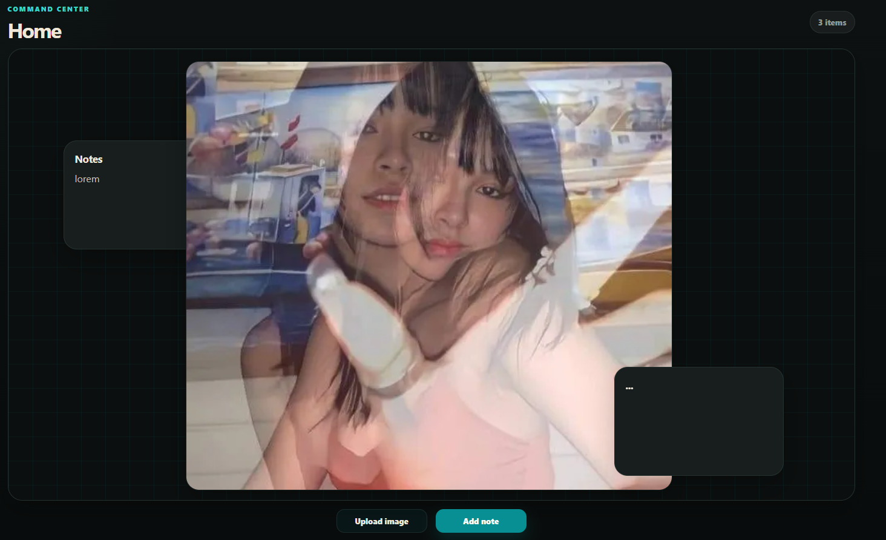
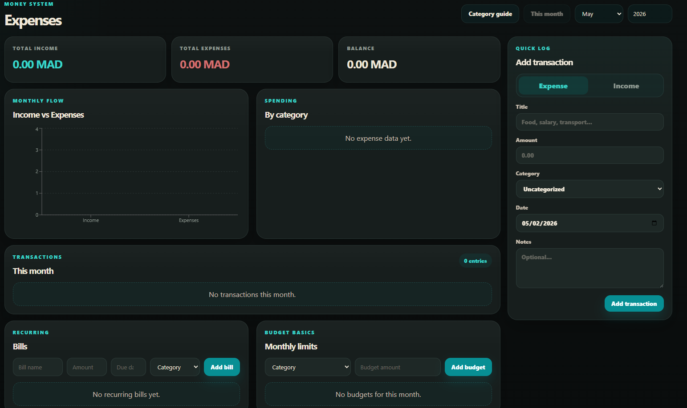
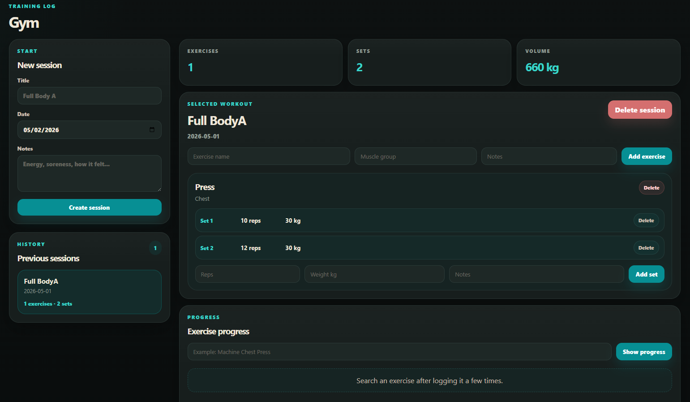
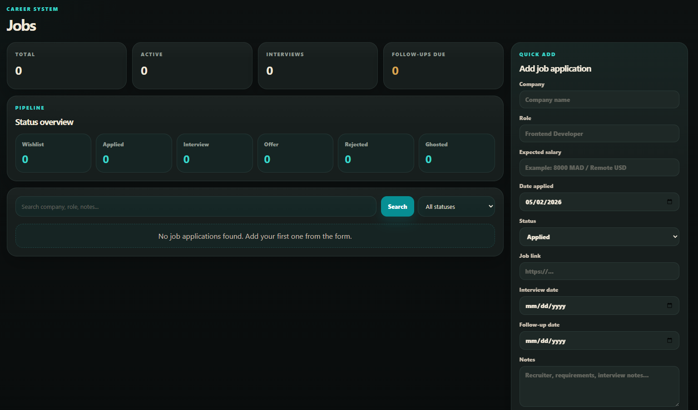
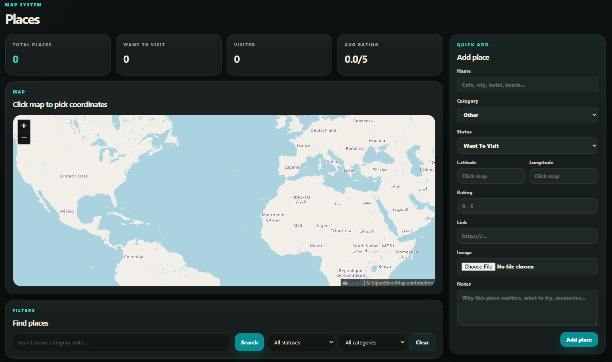

# Hey, I'm SevenLawless 👋


# ChioOS

ChioOS is a self-hosted personal Life OS — a desktop-first command center for tracking the parts of daily life that matter: money, workouts, job applications, documents, media, a wishlist, places, and a freeform home canvas. Built with React, Express, and MySQL. Runs locally or on a private VPS via Docker.


## Screenshots

### Home



### Expenses



### Gym Buddy



### Job Tracker



### Map Tracker



## Run Locally

Clone the project

```bash
  git clone https://github.com/SevenLawless/ChioOSVP
```

Go to the project directory

```bash
  cd ChioOS
```

Set up the backend

```bash
  cd server
  cp .env.example .env
  npm install
  npm run dev
```

Set up the frontend (in a separate terminal)

```bash
  cd client
  npm install
  npm run dev
```

Backend runs on `http://localhost:4001` — Frontend on `http://localhost:4000`


## 🚀 About Me

Full stack developer. ChioOS is my personal life management system — built for daily use, designed to be clean, private, and actually useful.


[](https://github.com/SevenLawless)
[](https://github.com/SevenLawless)


## Installation

For Docker / production setup, copy the example env file:

```bash
  cp .env.production.example .env.production
```

Edit `.env.production` with your own database credentials, then build and start:

```bash
  docker compose --env-file .env.production up -d --build
```

Run database migrations in order:

```bash
  docker exec -i chioos-mysql mysql -u<DB_USER> -p<DB_PASSWORD> life_os_v1 < database/migrations/001_init.sql
```

Repeat for `002` through `006`.


## Environment Variables

Copy `server/.env.example` to `server/.env` for local development.

| Variable | Description |
|---|---|
| `PORT` | Server port (default `4001`) |
| `DB_HOST` | MySQL host (use `localhost` for local dev) |
| `DB_USER` | MySQL username |
| `DB_PASSWORD` | MySQL password |
| `DB_NAME` | Database name (default `life_os_v1`) |
| `UPLOADS_DIR` | Path to uploads folder (default `../uploads`) |

For production, use `.env.production` with the additional Docker MySQL variables from `.env.production.example`.


## Support

For support, email 7lawless25@gmail.com
